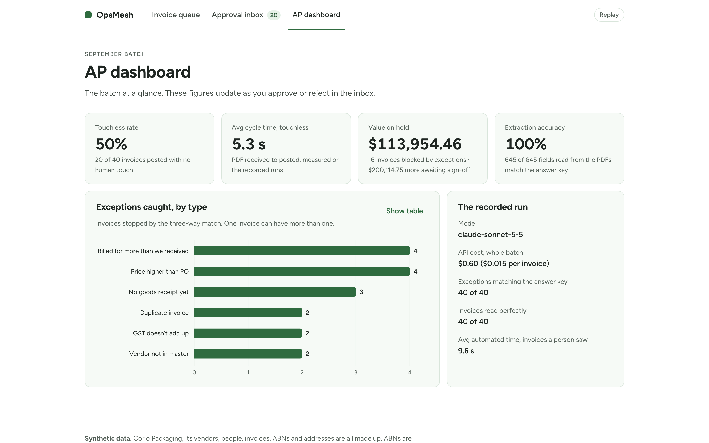
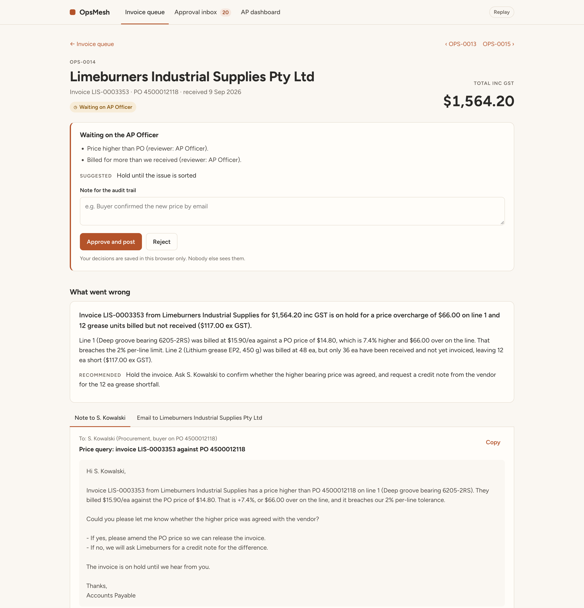
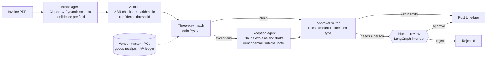
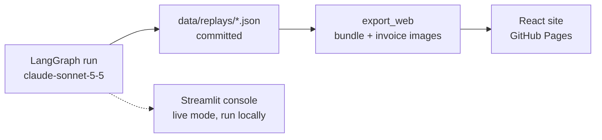
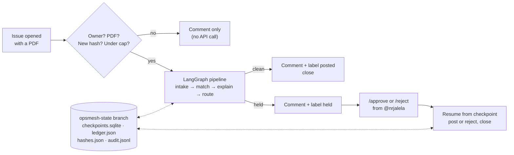

# OpsMesh

**Supplier-invoice automation for a (fictional) Geelong manufacturer: a Claude agent reads each invoice, plain code runs the three-way match, and anything risky waits for a person.**
Built by a former ERP implementation analyst, it handles the exceptions AP teams actually fight: short shipments, duplicate invoices, GST errors and a vendor-impersonation attempt.

**Live demo: [nrjalela.github.io/opsmesh](https://nrjalela.github.io/opsmesh/)** (recorded runs, free to explore, nothing to install)

> **100% of fields correct (645 of 645) across 40 invoices** · exceptions match the answer key on 40 of 40 · 50% touchless · $0.015 of API cost per invoice



> **All data is synthetic.** Corio Packaging, its 15 vendors, people, invoices and addresses are invented. ABNs are generated to pass the ATO checksum, so one could coincide with a real business by chance; none is meant to. Every invoice PDF is stamped "SYNTHETIC DOCUMENT", and email addresses use the reserved `.example` domain.

---

## What it does

Corio Packaging is a fictional packaging manufacturer in Geelong. Its AP team received 40 supplier invoices in September, from resin, cartons and ink through to freight and electrical contractors. OpsMesh processes each one:

1. **Intake agent (Claude).** Reads the PDF into a validated Pydantic schema, with a confidence score on every field.
2. **Validation (code).** ABN checksum, line and total arithmetic, and a confidence threshold.
3. **Three-way match (code).** Purchase order vs goods receipt vs invoice, with configurable tolerances.
4. **Exception agent (Claude).** Explains the problem in plain English and drafts the vendor email or internal note.
5. **Approval router (code).** Rules by amount and exception type. High-value or held invoices pause for a person with a LangGraph `interrupt`.
6. **Post or reject.** Posting sets a due date from the vendor's payment terms.

Every step is logged with its reasoning, rule trace, timing, tokens and cost, and you can read all of it for any invoice in the demo.



## Architecture



The workflow is a LangGraph `StateGraph` ([opsmesh/agents/graph.py](opsmesh/agents/graph.py)). It was run once against the Claude API, and each run was saved as a replay file. The public site replays those files, so anyone can explore it without spending API credits:



## Live mode: a real invoice through the real pipeline (GitHub Actions)

The demo site replays recorded runs. **Live mode** runs the same LangGraph pipeline for real, on GitHub's own infrastructure, with no extra accounts:

1. Open a **[Submit invoice](https://github.com/nrjalela/opsmesh/issues/new?template=submit-invoice.yml)** issue and upload a PDF. Only issues from @nrjalela are processed.
2. A workflow ([.github/workflows/live.yml](.github/workflows/live.yml)) checks the author, the PDF hash (so a duplicate costs nothing) and the daily cap of 5. It then runs intake, match, explanation and routing, with Claude called through a repository secret.
3. The bot comments with what it read, every match check, the exception explanation and the drafted follow-up. It labels the issue `posted`, `held` or `rejected`.
4. For a held invoice, comment `/approve <note>` or `/reject <note>`. The paused run resumes from its checkpoint, posts or rejects, and closes the issue.



**Where the paused run lives between Action runs.** Every run starts on a fresh machine, so state goes on a dedicated `opsmesh-state` branch: LangGraph's SQLite checkpointer, the live ledger, the PDF-hash index and an append-only audit log.
- It's durable, free and versioned: every decision is a commit.
- The Actions cache was ruled out because it can be evicted, and artifacts because they expire.
- The workflow's `concurrency` group runs one job at a time, so writes never collide.

**Safety on a public repo.**
- Only the owner can trigger work, and that check runs before any step that can see the API key.
- Issue text is passed to the code as data, never pasted into shell commands.
- PDFs are only fetched from GitHub's attachment host or this repo's sample invoices.
- The workflow token can only write issues and the state branch.
- Everything posted is public, so use the synthetic sample invoices only.

The [Controls page](https://nrjalela.github.io/opsmesh/#/controls) covers this in plain English, including where data is processed. Neither GitHub's runners nor the Claude API guarantee processing in Australia.

**Cost:** Actions minutes are free on public repos. Claude costs about $0.015 per invoice, capped at 5 a day.

## Why the matching is code, not an LLM

The model does what code can't: it reads messy documents and writes clear explanations. Deciding whether an invoice gets paid stays in plain, tested Python, for five reasons:

- **Auditors re-perform controls.** A match rule has to give the same answer every time, and someone has to be able to explain why. `match_invoice()` is deterministic, and its rule trace ("line 1: $15.90 vs PO $14.80, +7.4%, breaches the 2% limit") is the audit evidence.
- **Tolerances are policy, not prompts.** Finance sets "2% or $250 per line, whichever is lower" in [config/tolerances.yaml](config/tolerances.yaml), not in prose that a model might interpret.
- **LLMs are helpful in the wrong way.** A model might round away a $66 variance or "correct" a vendor's GST. The intake prompt explicitly tells Claude to transcribe the vendor's mistakes, because hiding them is the one thing the pipeline must never do.
- **It's free and instant.** The match step takes under 2 ms. The Claude calls take about 5 s each.
- **It's testable.** 163 pytest tests cover both sides of every tolerance. The engine agrees with the answer key on all 40 invoices.

Code also decides who hears about each exception. The model only writes the words. So an invoice from a lookalike vendor can never have its (fraudster's) email address put in the To: line, whatever the model writes. There's a test for exactly that.

## Exceptions handled

| Exception | Seeded in the demo | Who acts | What the agent drafts |
|---|---|---|---|
| **Price higher than PO** | Ink billed 4.5% over PO; caustic soda only 1.75% over but $450 on 18,000 L, which breaches the $250 cap | Buyer | Note asking whether the price was agreed |
| **Billed for more than received** (short-shipped) | 300 pallets billed, 20 rejected at the dock for broken bearers | Vendor | Email asking for a credit note |
| **Duplicate invoice** | An exact resend, and `LIS-0003321` vs `3321` as keyed last month | AP | Courtesy email: already in our system, won't be paid twice |
| **No goods receipt** | Invoice arrived before the warehouse receipted it; split PO whose next delivery isn't receipted | Receiving | Note to the warehouse |
| **Vendor not in master** | New contractor with no PO; a lookalike "Otway Adhesives" with a different ABN asking to change bank details | Vendor master team | Internal note only, with a warning about impersonation |
| **GST error** | GST charged on GST-free international freight; transposed digits ($1,286.20 vs $1,268.20) | Vendor | Email requesting a corrected tax invoice |

The engine also handles missing or wrong POs, lines not on the PO, services billed beyond the PO quantity, and invoices that don't add up. One invoice carries two exceptions at once.

**Details from real AP work:**
- Received quantities are cumulative across partial deliveries, net of what's already been invoiced.
- Freight and labour are two-way matched (no goods receipt).
- GST is checked against the PO's tax codes, with a 5¢ rounding allowance.
- Due dates follow each vendor's terms, including 30 days end of month.
- The approval router works like a delegation-of-authority matrix.

**The one surprise.** A per-thousand label invoice printed its quantity as "150 1000". Claude read it correctly but rated its own confidence at 60% and said why. The confidence check sent it to a person instead of auto-posting. That's why the touchless rate is 20 of 40, not 21.

**About the 100%.** These are clean, digitally generated PDFs in four layouts. Scanned or photographed invoices would be harder, which is why OCR is first on the list below. The answer key and the scoring code are in the repo: [data/answer_key.json](data/answer_key.json) and [opsmesh/replay/accuracy.py](opsmesh/replay/accuracy.py).

## What I'd build next

- **ERP connector.** Read POs and goods receipts from, and post invoices to, SAP S/4HANA (OData) or NetSuite, instead of JSON files. The engine already works on ERP-shaped records.
- **OCR for scanned invoices.** A document-AI pass for scans and phone photos, plus a harder evaluation set of real-world-quality images to measure against.
- **Learning from reviewers.** Use approve/reject decisions and field corrections to calibrate the confidence threshold per vendor and layout.
- **Email intake and vendor statements.** Pick invoices up from the AP mailbox, and reconcile monthly vendor statements against the ledger to catch missing invoices.

## Run it yourself

The live console is the Streamlit app, and it runs locally. Replay mode needs no API key. Live mode runs the real agents on any sample invoice or an uploaded PDF (password-gated, about 1–3¢ per invoice).

```bash
python3 -m venv .venv && .venv/bin/pip install -r requirements-dev.txt
```

```bash
.venv/bin/python -m pytest
```

```bash
cp .env.example .env
```

Then set `ANTHROPIC_API_KEY` and `LIVE_MODE_PASSWORD` in `.env`, and start the console:

```bash
.venv/bin/streamlit run streamlit_app.py
```

Rebuild everything from scratch:

| Step | Command |
|---|---|
| Regenerate the synthetic data and PDFs (seeded, byte-identical) | `.venv/bin/python -m opsmesh.data.generate` |
| Confirm the model ID with one tiny call | `.venv/bin/python -m scripts.check_model` |
| Record all 40 runs (about $0.60) and score extraction | `.venv/bin/python -m opsmesh.replay.record --force` |
| Bundle replays for the website | `.venv/bin/python -m opsmesh.replay.export_web` |
| Run the React site locally | `cd web && npm ci && npm run dev` |

CI runs the Python and web tests on every push and deploys the site to GitHub Pages from `main` ([.github/workflows/ci.yml](.github/workflows/ci.yml)). Live mode needs one repository secret, set once with `gh secret set ANTHROPIC_API_KEY`.

## Project layout

```
opsmesh/
  engine/      three-way match, ABN checksum, payment terms (no LLM)
  agents/      intake + exception agents, router, LangGraph workflow
  data/        synthetic dataset generator and PDF layouts
  replay/      recording, accuracy scoring, web export
config/        tolerances and approval rules (YAML)
data/          vendor master, POs, receipts, AP ledger, invoices, replays, answer key
  live/        GitHub Actions live mode: issue parsing, gate, state branch, comments
web/           React + TypeScript replay site (GitHub Pages)
app/, streamlit_app.py   local Streamlit console with live mode
tests/         pytest: engine, schema, offline graph, Streamlit smoke test
```

**Stack:** Python 3.13, LangGraph, Anthropic SDK (`claude-sonnet-5-5`, structured outputs, adaptive thinking, server-side refusal fallback), Pydantic, reportlab, Streamlit, React 19 + TypeScript + Vite, Vitest, GitHub Actions.

---

Built by Nihar Jalela · [LinkedIn](https://www.linkedin.com/in/niharjalela/) · [GitHub](https://github.com/nrjalela)
